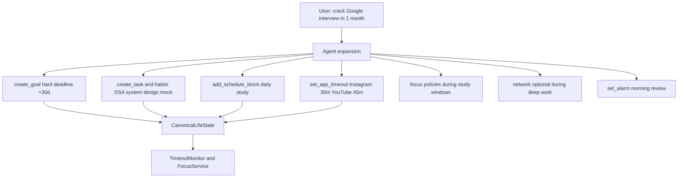
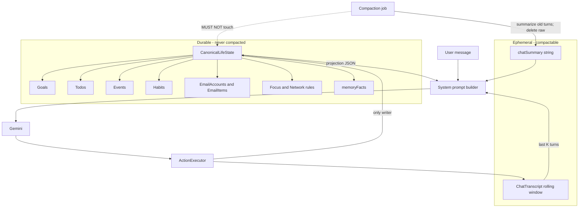
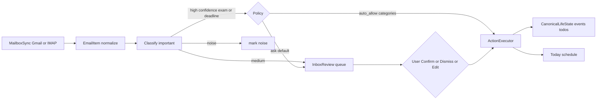

# LifeOS — Complete Hackathon Plan (Agentic, Compaction-Proof, Email-Aware)

**Product:** LifeOS — a personal AI OS that **executes and enforces**, with **durable life state** that survives chat compaction, plus **email → schedule** ingestion.  
**Constraint:** ~3h build / ~4h submission (`[context.txt](context.txt)`).  
**Stack (locked):** Kotlin + Jetpack Compose, Gemini Flash (JSON schema), local durable store, no backend server.  
**Wedge:** Chat → actions → real device effects (alarms, focus overlay, VPN). Google will not ship opinionated distraction control (`[raw.txt](background/raw.txt)`).

---


## 1. Product thesis


| Layer               | Role                                                                                                                         |
| ------------------- | ---------------------------------------------------------------------------------------------------------------------------- |
| **Intent**          | Natural language + inbound email                                                                                             |
| **Plan**            | Model returns `reply` + typed `actions[]`                                                                                    |
| **Canonical state** | Goals, todos, events, habits, email-derived items live in a **durable store outside the LLM context**                        |
| **Execute**         | `ActionExecutor` is the **only** writer to canonical state + OS APIs                                                         |
| **Expand**          | A goal/habit utterance becomes a **bundle** of schedules, todos, app timeouts, focus/VPN policies — not a lone row in a list |
| **Enforce**         | FocusService + **daily app timeouts** + LifeOsVpnService + AlarmManager                                                      |
| **Reflect**         | Today / Goals / Inbox / Wellbeing read the same store                                                                        |


**Critical design law:** Chat history is ephemeral and compactable. **Life state is not.** If the model “forgets” a goal because the transcript was summarized, the goal must still exist in `CanonicalLifeState` and be re-injected every turn.

**Second design law (goal expansion):** Saying “I want X” is insufficient if the app only stores the sentence. The agent **must emit concrete enforcement and schedule actions** within the app’s capability set (timeouts, focus rules, calendar blocks, alarms, habits). The user can reject/edit; default is propose-and-apply in one turn for the hackathon demo (with a short confirmation summary in `reply`).

**Canonical demo utterances:**

1. *"I want to crack a Google interview in 1 month."* → goal + study schedule + **Instagram 30 min/day timeout** + YouTube timeout + weekday focus blocks + alarms
2. Focus whitelist; DSA + Instagram block + 7am wake; gym habit; bedtime/morning reminders
3. *"Check my email for exams or deadlines"* → Inbox ask → promote to Today

---


## 1b. Goal / habit → capability expansion (core agent behavior)

When the user incorporates a **goal** or **habit**, the agent runs an **expansion pass**: one LLM response returns many actions that fill `CanonicalLifeState` and wire OS enforcement.




### Expansion playbook (prompted into the model)

For each new **hard** goal with a deadline, the system prompt instructs the model to emit, when relevant:


| Capability             | Example for “Google interview / 1 month”                                   |
| ---------------------- | -------------------------------------------------------------------------- |
| Goal record            | title, deadline ISO, `hardness=hard`                                       |
| Milestone tasks        | weekly DSA sets, system design notes, mock interview                       |
| Recurring habits       | “LeetCode daily 45m”, “Mock interview Sat”                                 |
| Schedule blocks        | Weekday 19:00–21:00 Study; Sat 10:00–12:00 Mock                            |
| **App daily timeouts** | Instagram **30 min/day**, YouTube **45 min/day**, Twitter/X **15 min/day** |
| Focus windows          | During study blocks: whitelist Chrome/Docs/LifeOS **or** blacklist IG/YT   |
| Network (optional)     | During deep-work blocks: network blacklist IG/YT packages                  |
| Alarms                 | Morning standup; bedtime “Did you do LeetCode?”                            |
| memoryFacts            | “Interview grind; strict on social timeouts”                               |


For a **habit** alone (“gym Mon/Wed/Fri 18:30”): create habit + remind-before alarm + optional light timeout relax on gym days (P1). Do not invent interview-level timeouts.

### App daily timeouts (digital wellbeing limits) — P0

Distinct from session focus:


| Mode              | Behavior                                                                                                                                                                                                                  |
| ----------------- | ------------------------------------------------------------------------------------------------------------------------------------------------------------------------------------------------------------------------- |
| **Focus session** | While active: whitelist/blacklist via overlay (and optional VPN)                                                                                                                                                          |
| **App timeout**   | All day: track per-package usage with `UsageStatsManager`; when `usedToday >= limitMinutes`, treat like blacklist hit → **overlay** (“Instagram limit 30m — Google interview in 26 days”) until midnight or user Override |


Implementation: `TimeoutMonitor` inside the same FGS loop as FocusService (one process): each poll, compute today’s ms for watched packages; if over limit and not in override grace, show overlay. Limits stored in `CanonicalLifeState.appTimeouts[]` with optional `sourceGoalId` so Wellbeing can show “From: Google interview”.

**No Play Digital Wellbeing API** to write system limits — we enforce ourselves (same as other blockers). Requires same `PACKAGE_USAGE_STATS` + `SYSTEM_ALERT_WINDOW`.

### Confirmation UX

- Hackathon default: **apply expansion immediately**, `reply` lists what changed (“Goal set. Instagram capped at 30m/day. Study 7–9pm weekdays…”).  
- Buttons in chat bubble: **Undo expansion** → `revert_expansion` for `goalId` (deletes entities with that `sourceGoalId`).  
- Settings later: “Ask before applying timeouts” (P1).


### Offline fallback (mandatory)

Hardcode expansion JSON for: *“crack Google interview in 1 month”* including `set_app_timeout` Instagram 30.

---


## 2. Long-term context architecture (compaction-proof)

This is how production agents keep “memory” without lying to themselves: **structured state ≠ chat tokens**.




### 2.1 Two stores


| Store                | Contents                                                                                                                        | Compaction                                                                        | Writers               |
| -------------------- | ------------------------------------------------------------------------------------------------------------------------------- | --------------------------------------------------------------------------------- | --------------------- |
| `CanonicalLifeState` | goals, todos, events, habits, schedule blocks, alarms, focus/network rules, email accounts, email items, memoryFacts, xp/streak | **Never compacted, never summarized away**                                        | `ActionExecutor` only |
| `ChatTranscript`     | role/content/timestamp messages                                                                                                 | Keep last **K=20** turns; older → fold into `chatSummary` (≤2k chars); delete raw | Chat repository       |


### 2.2 What the model sees every turn

System prompt assembly (deterministic):

1. Persona instructions
2. `LifeStateProjection` — compact JSON of active goals, open todos, next 7 days events/habits/blocks, **appTimeouts** (package + limit + used), pending email candidates, focus/network mode, top memoryFacts (cap ~3–6k chars)
3. `chatSummary` (optional)
4. Last K transcript turns
5. New user message
6. Tooling contract: allowed `actions[]` types only

**Implication:** Context compaction may drop “we talked about gym,” but `habits[]` still contains gym Mon/Wed/Fri 18:30, so the projection still shows it. The agent updates life state via actions (`create_goal`, `promote_email`, …), not by “remembering in prose.”

### 2.3 Why not “put everything in the prompt forever”

Token limits force compaction. If goals lived only in chat text, compaction **corrupts** the product. LifeOS treats the LLM as a **planner/controller**; the **database is the soul**. This matches the vision’s “Persistent Life Memory” (`[LifeOS_Startup_Vision.md](background/LifeOS_Startup_Vision.md)`) without pretending chat logs are a database.

### 2.4 Persistence implementation (P0)

- Prefer **DataStore + kotlinx.serialization** for speed in 3h; schema version field `schemaVersion`.  
- If state grows (email bodies): split **metadata in DataStore** + **email body cache files** under app storage; projection includes subject/from/date/snippet only.  
- Optional later: Room. Not required for hackathon if JSON stays < ~200KB.  
- Export/debug: More tab → “Dump life state” (no secrets).


### 2.5 Agent update rules

- Agent **may** update any life-state entity anytime via actions.  
- Agent **must not** invent deletes without user intent; prefer soft `archived=true`.  
- Idempotent upserts keyed by stable `id` (UUID) or natural keys (`emailMessageId`, habit title+time).  
- After email promote / task complete, projection changes immediately — next turn sees truth.

---


## 3. Email reading → schedule (Gmail / IMAP)

Vision already calls out university email / announcements (`[LifeOS_Startup_Vision.md](background/LifeOS_Startup_Vision.md)` §Proactive Life Management). User ask: read mail, detect exams/events, auto-add **or ask** if important.

### 3.1 Pipeline




### 3.2 Importance policy (default for prototype)


| Classifier output                                                                   | Behavior                                                                                                                                       |
| ----------------------------------------------------------------------------------- | ---------------------------------------------------------------------------------------------------------------------------------------------- |
| `exam`, `deadline`, `registration`, `interview`, `event` with confidence ≥ 0.75     | Create `EmailCandidate`; agent **asks** in Chat: “Midterm OS Fri 14:00 — add to schedule?” Buttons = actions `promote_email` / `dismiss_email` |
| Same categories, confidence ≥ 0.9 **and** user enabled `autoScheduleHighConfidence` | Auto `create_event` + still show toast / Inbox “Auto-added” for undo                                                                           |
| `newsletter`, `promo`, `social`                                                     | Mark noise; do not surface                                                                                                                     |
| Ambiguous                                                                           | Ask                                                                                                                                            |


**Default = ask.** Auto-add is an opt-in toggle in More/Inbox. Safer for demos and trust.

### 3.3 Connectors


| Connector                | How                                                                                       | Hackathon triage                                 | Production note                                                     |
| ------------------------ | ----------------------------------------------------------------------------------------- | ------------------------------------------------ | ------------------------------------------------------------------- |
| **Seed / demo mailbox**  | Bundled JSON emails (exam, hackathon, spam)                                               | **P0** — always works offline                    | Demo reliability                                                    |
| **IMAP**                 | Jakarta Mail; host/user/password or app password; folders INBOX; fetch UNSEEN/last N days | **P0-stretch** — one settings form + sync worker | Good for university mail                                            |
| **Gmail API**            | Google Sign-In / Authorization Client; scope `gmail.readonly`; list+get messages          | **P1** if OAuth client IDs ready; else stub      | Play: CASA for sensitive scopes in prod; test users OK at hackathon |
| **NotificationListener** | Read Gmail notifications only                                                             | **P2** fallback — incomplete bodies              | No IMAP needed; weak                                                |


**Locked approach:** Define `MailboxSync` interface with `SeedMailboxSync`, `ImapMailboxSync`, `GmailMailboxSync`. UI “Add account” supports IMAP fields + “Sign in with Google” button (P1). Demo button “Load sample university inbox” uses Seed.

### 3.4 Classifier

- **P0:** Gemini call with email subject+snippet+from → JSON `{category, confidence, suggestedTitle, suggestedStart, suggestedEnd, hardness}` using same key as chat; fallback regex heuristics (midterm|exam|due|deadline|registration).  
- Store result on `EmailItem`; never write Events until promote/auto policy.


### 3.5 Permissions / secrets for email


| Need               | Mechanism                                                                                                    |
| ------------------ | ------------------------------------------------------------------------------------------------------------ |
| Network            | `INTERNET`                                                                                                   |
| IMAP credentials   | `EncryptedSharedPreferences` or Android Keystore-backed prefs — **never** in CanonicalLifeState dumps / logs |
| Gmail OAuth tokens | Google auth library; refresh in sync worker                                                                  |
| Play / policy      | `gmail.readonly` → CASA for production; declare data safety “email”                                          |
| No `READ_SMS`      | Email ≠ SMS                                                                                                  |


---


## 4. Vision feature catalog → triage (updated)

**Legend:** **P0** must ship in 3h · **P1** if ≥25 min after P0 · **P2** later · **X** blocked / wrong.

### 4.1 Agent & durable memory


| ID  | Feature                                        | Triage | Notes                   |
| --- | ---------------------------------------------- | ------ | ----------------------- |
| A1  | Chat agent surface                             | **P0** |                         |
| A2  | Structured `actions[]`                         | **P0** |                         |
| A3  | **CanonicalLifeState** separate from chat      | **P0** | Compaction-proof core   |
| A4  | Chat rolling window + `chatSummary` compaction | **P0** | Compact transcript only |
| A5  | memoryFacts list                               | **P0** | Inside canonical state  |
| A6  | Persona picker (3)                             | **P0** |                         |
| A7  | Marketplace / relationship arcs                | **P2** |                         |
| A8  | Therapist / journaling                         | **X**  |                         |


### 4.2 Goals, todos, events, habits, schedule, expansion


| ID  | Feature                                              | Triage | Notes                                   |
| --- | ---------------------------------------------------- | ------ | --------------------------------------- |
| G1  | Goals                                                | **P0** | In canonical state                      |
| G2  | Todos/tasks                                          | **P0** |                                         |
| G3  | **Events** (exams, deadlines, calendar items)        | **P0** | First-class; email promotes here        |
| G4  | Deadline risk %                                      | **P0** |                                         |
| G5  | Today day schedule                                   | **P0** | Merges tasks, habits, events, blocks    |
| G6  | Habits                                               | **P0** |                                         |
| G7  | **Goal/habit expansion** into schedule + enforcement | **P0** | One utterance → many actions            |
| G8  | `sourceGoalId` linkage + undo expansion              | **P0** | Trace timeouts/tasks to goal            |
| G9  | Week calendar                                        | **P1** |                                         |
| G10 | Adaptive replan when behind                          | **P2** | Soft: agent can emit more actions later |


### 4.3 Email


| ID  | Feature                              | Triage         | Notes                    |
| --- | ------------------------------------ | -------------- | ------------------------ |
| E1  | Inbox review UI (candidates)         | **P0**         | Confirm / dismiss / edit |
| E2  | Seed demo mailbox + classify         | **P0**         | Hackathon-proof          |
| E3  | Ask-before-schedule policy           | **P0**         | Default                  |
| E4  | Auto-schedule high-confidence opt-in | **P1**         | Toggle                   |
| E5  | IMAP sync                            | **P0-stretch** | Real account if time     |
| E6  | Gmail OAuth readonly                 | **P1**         | Needs client IDs         |
| E7  | Continuous IDLE / push               | **P2**         | Periodic sync enough     |
| E8  | Full body RAG over years of mail     | **P2**         | Snippets only in P0      |


### 4.4 Focus / wellbeing / timeouts / network / alarms / XP


| ID    | Feature                                                 | Triage | Notes                          |
| ----- | ------------------------------------------------------- | ------ | ------------------------------ |
| F1–F6 | Focus whitelist/blacklist + overlay + Wellbeing toggles | **P0** | As before                      |
| F8    | VPN app-level network                                   | **P0** |                                |
| T1    | **Per-app daily timeouts** (e.g. IG 30m)                | **P0** | UsageStats + overlay when over |
| T2    | Timeout sourced from goal expansion                     | **P0** | Show “From: Google interview”  |
| T3    | Override grace 10m                                      | **P0** | Same as focus override         |
| X1    | XP + streak                                             | **P0** |                                |
| —     | Accessibility / SMS / OS kill                           | **X**  |                                |


---


## 5. Information architecture

Bottom nav (6): **Chat · Today · Goals · Inbox · Wellbeing · More**


| Tab           | Role                                                                                                                  |
| ------------- | --------------------------------------------------------------------------------------------------------------------- |
| **Chat**      | Agent; shows “Inbox: 2 items need decisions” soft prompts                                                             |
| **Today**     | Day timeline from canonical events/tasks/habits/alarms                                                                |
| **Goals**     | Goals + todos                                                                                                         |
| **Inbox**     | Email candidates + account status; promote/dismiss                                                                    |
| **Wellbeing** | Focus mode + **per-app timeouts** + allow/block + network VPN; shows source goal on limits                            |
| **More**      | Persona, compaction stats, life-state intact indicator, permissions, email accounts, auto-schedule toggle, demo reset |


---


## 6. Action schema (email + expansion + life state)

Existing P0 actions kept (`create_goal`, `create_task`, `create_habit`, `add_schedule_block`, `set_alarm`, `focus_*`, `network_*`, `remember`, `complete_task`, …).

**Email + lifecycle:**


| `type`                                                                                       | Fields                                                                       | Effect          |
| -------------------------------------------------------------------------------------------- | ---------------------------------------------------------------------------- | --------------- |
| `create_event`                                                                               | `title`, `start`, `end?`, `hardness?`, `source`, `emailId?`, `sourceGoalId?` | Canonical event |
| `sync_mailbox` / `classify_email` / `propose_from_email` / `promote_email` / `dismiss_email` | (as before)                                                                  | Inbox pipeline  |
| `archive_entity`                                                                             | `kind`, `id`                                                                 | Soft-archive    |


**Goal expansion / timeouts:**


| `type`               | Fields                                         | Effect                                                                                 |
| -------------------- | ---------------------------------------------- | -------------------------------------------------------------------------------------- |
| `expand_goal`        | `goalId` or inline goal fields                 | Optional explicit trigger; usually expansion is implicit in same turn as `create_goal` |
| `set_app_timeout`    | `package`, `limitMinutes`, `sourceGoalId?`     | Daily cap; TimeoutMonitor enforces                                                     |
| `clear_app_timeout`  | `package` or `sourceGoalId`                    | Remove limit(s)                                                                        |
| `revert_expansion`   | `goalId`                                       | Delete/archive all entities with that `sourceGoalId`                                   |
| `set_focus_schedule` | `windows[]` (days, start, end, mode, packages) | Auto focus during study blocks (P0: store windows; FGS checks time)                    |


All created tasks/habits/blocks/timeouts/alarms from an expansion **must** carry `sourceGoalId` for undo and Wellbeing attribution.

**Example actions for Google interview (abbreviated):**

```json
{
  "reply": "One month. Instagram is 30 minutes a day. Study blocks are on your calendar.",
  "actions": [
    {"type":"create_goal","id":"g_google","title":"Crack Google interview","deadline":"2026-09-30","hardness":"hard"},
    {"type":"create_habit","title":"LeetCode daily","daysOfWeek":[1,2,3,4,5,6,7],"time":"19:00","sourceGoalId":"g_google"},
    {"type":"add_schedule_block","title":"Interview grind","start":"19:00","end":"21:00","kind":"study","sourceGoalId":"g_google"},
    {"type":"set_app_timeout","package":"com.instagram.android","limitMinutes":30,"sourceGoalId":"g_google"},
    {"type":"set_app_timeout","package":"com.google.android.youtube","limitMinutes":45,"sourceGoalId":"g_google"},
    {"type":"set_focus_schedule","windows":[{"daysOfWeek":[1,2,3,4,5],"start":"19:00","end":"21:00","mode":"blacklist","packages":["com.instagram.android","com.google.android.youtube"]}],"sourceGoalId":"g_google"},
    {"type":"set_alarm","time":"22:30","personaLine":"LeetCode done?","label":"bedtime-dsa","sourceGoalId":"g_google"},
    {"type":"remember","fact":"Google interview in 1 month; strict social timeouts"}
  ]
}
```

---


## 7. Data model

```text
CanonicalLifeState
  schemaVersion
  personaId
  memoryFacts: string[]
  goals: Goal[]            // id, title, deadline, hardness, archived?
  tasks: Todo[]            // + sourceGoalId?
  events: Event[]
  habits: Habit[]          // + sourceGoalId?
  scheduleBlocks: Block[]  // + sourceGoalId?
  alarms: Alarm[]          // + sourceGoalId?
  appTimeouts: AppTimeout[] // package, limitMinutes, sourceGoalId?, usedTodayMs(cache)
  focus: FocusRules        // active session + scheduled windows[]
  network: NetworkRules
  emailAccounts / emailItems / emailCandidates
  settings: { autoScheduleHighConfidence, chatWindowK, askBeforeTimeouts? }
  gamification: { xp, streakDays, lastActiveDate }

ChatTranscript
  messages: ChatMessage[]
  chatSummary: string
```

**Compaction job:** transcript only. **Zero writes** to `CanonicalLifeState`.

---


## 8. Enforcement + permissions (email-aware)


| Mechanism           | Role                                                                                                    |
| ------------------- | ------------------------------------------------------------------------------------------------------- |
| FocusService FGS    | Session whitelist/blacklist + **scheduled focus windows** + **timeout overlay** when daily cap exceeded |
| UsageStats          | Foreground detection + **today’s usage ms** per package for timeouts                                    |
| SYSTEM_ALERT_WINDOW | Block UI                                                                                                |
| LifeOsVpnService    | Optional network starve during deep work                                                                |
| AlarmManager        | Reminders from expansion                                                                                |


**Email adds:** `INTERNET`; OAuth/IMAP secrets encrypted.  
**Onboarding:** Notifications → Exact alarms → Usage access → Overlay → VPN → optional mail account.

---


## 9. Cloud Agent environment

Unchanged: `/opt/android-sdk`, cmdline-tools, **adb** platform-tools, build-tools 34, platforms android-34; install/start scripts; snapshot → draft build → propose.

---


## 10. Three-hour schedule (adjusted)


| Window    | Work                                                                       | Exit criteria                                             |
| --------- | -------------------------------------------------------------------------- | --------------------------------------------------------- |
| 0:00–0:15 | SDK/adb + scaffold + nav                                                   | App launches; `adb version`                               |
| 0:15–0:35 | CanonicalLifeState + ChatTranscript + compaction + ActionExecutor          | Compact chat; goals remain                                |
| 0:35–1:00 | Chat + Gemini + **expansion playbook** + Google-interview offline fallback | One utterance → goal+timeouts+schedule                    |
| 1:00–1:20 | Goals + Today + timeouts on Wellbeing                                      | IG 30m visible; source goal labeled                       |
| 1:20–1:40 | Seed email + Inbox promote                                                 | Email → event                                             |
| 1:40–2:10 | FocusService + **TimeoutMonitor** in same FGS                              | Over-limit overlay works (seed usage or short demo limit) |
| 2:10–2:25 | VPN app-level                                                              | Consent + mode                                            |
| 2:25–2:40 | Alarms/TTS + onboarding                                                    | T+60s alarm                                               |
| 2:40–2:55 | IMAP stretch or polish / undo expansion                                    |                                                           |
| 2:55–3:00 | APK + demo                                                                 | `adb install`                                             |


**Cut order:** Gmail → IMAP → DNS VPN → scheduled focus windows (keep manual focus + timeouts) → TTS. **Never cut:** expansion → `set_app_timeout`, CanonicalLifeState, seed email ask/promote, overlay, offline interview fallback.

**Demo trick for timeouts:** offline expansion can set Instagram limit to **1 minute** via a “Demo strict mode” button so overlay triggers immediately on stage; production reply still says 30 min (or show both: real 30 + demo 1).

---


## 11. Demo script

1. Compaction proof: life-state counts stable after compact.
2. Chat: *“Crack Google interview in 1 month”* → Goals + Today study blocks + Wellbeing **Instagram 30m** (from goal).
3. Open Instagram past limit (or demo 1m) → overlay with deadline copy.
4. Seed email midterm → ask → confirm → Today.
5. Alarm T+60s; complete a task → XP.

---


## 12. Risks


| Risk                         | Mitigation                                                      |
| ---------------------------- | --------------------------------------------------------------- |
| Model only creates goal text | Expansion playbook + schema; offline fallback includes timeouts |
| Can’t demo 30m wait          | Demo 1-minute limit button                                      |
| Compaction deletes goals     | Canonical store only                                            |
| Email / Gmail time sink      | Seed P0                                                         |
| Timeout false positives      | Override grace; midnight reset                                  |


---


## 13. Acceptance criteria

- [ ] `adb` + SDK validated  
- [ ] Chat compaction does not reduce goal/todo/event/timeout counts  
- [ ] *Google interview / 1 month* (or offline fallback) creates goal **and** Instagram timeout **and** at least one schedule/habit  
- [ ] Exceeding timeout shows overlay attributing the active goal  
- [ ] `revert_expansion` clears sourced entities  
- [ ] Seed email → ask → promote → Today  
- [ ] Focus session overlay + VPN consent path work  
- [ ] Alarm in demo window  

---


## 14. Deliverables on approval

1. Environment (SDK + adb) snapshot/build/propose.
2. Plan under `[.cursor/plans/](.cursor/plans/)`.
3. P0 app: canonical state + **goal expansion with app timeouts** + seed email + focus/VPN/alarms.
4. No AccessibilityService; no P2 sprawl.

