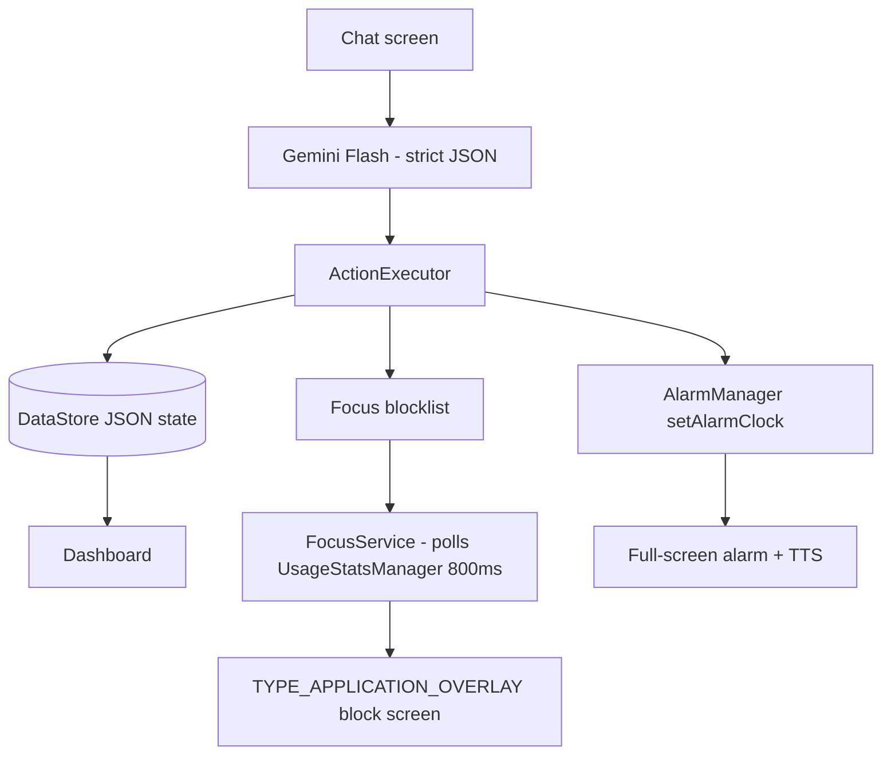

# LifeOS Hackathon Prototype — 3 Hour Build Plan

## The bet

Every hackathon has five AI todo apps. The differentiator is that LifeOS **converts a sentence into enforced system state**: real alarms that fire, and a blocking overlay that physically stops you from opening Instagram. Build only what serves that.

Target: Android 14/15 phone, sideloaded debug APK. Kotlin + Jetpack Compose, single module, no backend.

## Demo narrative (build backwards from this)

1. Chat: *"I have a DSA assignment due Tuesday, I keep doomscrolling Instagram, wake me at 7."*
2. AI replies in the chosen persona **and** the dashboard instantly fills in: goal, tasks, deadline with risk %, a 7:00 alarm, Instagram added to the focus blocklist.
3. Tap **Start Focus**. Leave the app, open Instagram → LifeOS overlay slams in front: *"You said Tuesday. Two days left."* with `Back to work` / `Override`.
4. Alarm fires (set 60s out for the demo) → full-screen wake-up, persona line spoken aloud via TTS.
5. Dashboard: XP gained, streak, deadline risk drops.

Six pillars from the vision doc in 90 seconds: planning, memory, personality, focus enforcement, alarms, gamification.

## Explicitly out of scope

Health Connect, Moodle/email/Piazza integration, mood tracking, journaling, personality marketplace, reward engine, cloud sync, auth, iOS. Do not start any of these.

## Android capability audit

This is the feasibility pass over the vision doc, done before scoping. It answers two questions: what can a normal app actually do, and where does the wall sit.

### Cleanly doable — no Play approval drama

| Vision feature | Mechanism |
| --- | --- |
| Reminders, nags, escalating notifications | `POST_NOTIFICATIONS` (runtime, A13+) |
| Precise-time alarms and wake-ups | `SCHEDULE_EXACT_ALARM` — user grants in Settings, no Play review |
| Persistent focus session | `FOREGROUND_SERVICE` + typed subtype (A14+), `WAKE_LOCK`, `VIBRATE` |
| Survive reboot | `RECEIVE_BOOT_COMPLETED` |
| Deadlines synced to phone calendar | `READ_CALENDAR` / `WRITE_CALENDAR` |
| Screen time stats, detect foreground app | `PACKAGE_USAGE_STATS` (Settings toggle, low scrutiny) |
| Read other apps' notifications (Gmail, Classroom, WhatsApp) | `NotificationListenerService` — the clean substitute for SMS/email reading |
| Steps, sleep, heart rate | Health Connect + `ACTIVITY_RECOGNITION` |
| Voice personalities, spoken wake-ups | Android TTS (no permission), `RECORD_AUDIO` for voice input |
| Blocking overlay UI | `SYSTEM_ALERT_WINDOW` (Settings toggle) |

### The central constraint: app blocking has no API

There is no Android API to block another app. Every blocker on the market fakes it the same way: detect the foreground app, then cover it or bounce the user home.

- Detect via `UsageStatsManager` polling (~800ms latency, simple Settings toggle) **or** an `AccessibilityService` (<100ms, sensitive).
- Cover via a `TYPE_APPLICATION_OVERLAY` window, or fire a `HOME` intent.

The accessibility route is the trap. A focus app **cannot** declare `isAccessibilityTool` — Google explicitly names "monitoring apps" as ineligible, and that flag is reserved for disability-support software. You can still ship (Opal is live on Play doing exactly this), but it costs a Permission Declaration Form, prominent disclosure *inside the app* rather than in the listing, affirmative consent before the Settings hand-off, and a demo video with each submission. On top of that, Android 17's Advanced Protection Mode auto-revokes accessibility access from non-tool apps, so the feature silently dies for those users.

Conclusion: use `PACKAGE_USAGE_STATS` polling. 800ms is imperceptible, and it sidesteps the entire policy surface.

### Hard walls for a real launch

- **`READ_SMS` / `READ_CALL_LOG`** — restricted to the default SMS handler. Effectively unobtainable. Use the notification listener instead.
- **`USE_EXACT_ALARM`** (auto-granted alarms) — reserved for apps whose *core* purpose is a clock, timer, or calendar. LifeOS is not, so `SCHEDULE_EXACT_ALARM` is the only option.
- **`QUERY_ALL_PACKAGES`, `REQUEST_IGNORE_BATTERY_OPTIMIZATIONS`, background location** — each needs a declaration form with justification.
- **Gmail `gmail.readonly` scope** — needs a Google CASA security assessment (weeks, and money) for production. Fine for a hackathon under test users.
- **iOS equivalent of focus enforcement** — the Screen Time API (`FamilyControls` / `ManagedSettings` / `DeviceActivity`) requires an Apple entitlement you apply for and wait weeks on. Android-only is the correct call.
- **Moodle / Piazza / university ERP** — not a phone permission at all. These are server-side integrations or scraping. Out of scope; fake with a seeded inbox if it ever needs demoing.
- **OEM battery killers** (Xiaomi, Oppo, Vivo autostart managers) — the real-world reason background agents die. No API fix exists. Production answer is a per-OEM settings guide screen.

## Permissions we actually declare

Declare exactly this set. Nothing here needs Play approval to demo, and everything here has a viable production path.

Runtime prompt:
- `POST_NOTIFICATIONS`

Special access — each needs a Settings hand-off, so build a single onboarding screen with three "Grant" buttons:
- `SCHEDULE_EXACT_ALARM` → `ACTION_REQUEST_SCHEDULE_EXACT_ALARM`. Gate every alarm on `canScheduleExactAlarms()`.
- `PACKAGE_USAGE_STATS` → `ACTION_USAGE_ACCESS_SETTINGS`. Verify with `AppOpsManager.unsafeCheckOpNoThrow`.
- `SYSTEM_ALERT_WINDOW` → `ACTION_MANAGE_OVERLAY_PERMISSION`. Verify with `Settings.canDrawOverlays()`. This also exempts us from Android 10+ background-activity-launch restrictions, which we need.

Normal:
- `FOREGROUND_SERVICE` + `FOREGROUND_SERVICE_SPECIAL_USE` (A14 requires the subtype property in the manifest)
- `WAKE_LOCK`, `VIBRATE`, `RECEIVE_BOOT_COMPLETED`, `INTERNET`
- `USE_FULL_SCREEN_INTENT` — on A14 this is auto-granted only to calling/alarm apps, so fall back to a high-priority notification if `canUseFullScreenIntent()` is false.

For the blocklist app picker, use a `<queries>` element rather than `QUERY_ALL_PACKAGES` — same result, no Play declaration:

```xml
<queries><intent>
  <action android:name="android.intent.action.MAIN" />
  <category android:name="android.intent.category.LAUNCHER" />
</intent></queries>
```

Deliberately avoided: `READ_SMS` (unobtainable), `AccessibilityService` (Play declaration + Android 17 Advanced Protection revokes it), `USE_EXACT_ALARM` (reserved for clock apps), `REQUEST_IGNORE_BATTERY_OPTIMIZATIONS`, background location.

## Architecture



**Skip Room.** KSP annotation processing costs build time we don't have. Use `kotlinx.serialization` + a single `DataStore<Preferences>` string key holding the whole `AppState` JSON. It is a prototype; state is small.

### The one clever piece

A single LLM call returns both the persona reply and a list of state mutations. This is what makes the demo feel magic and it is genuinely ~80 lines of code.

```json
{
  "reply": "Tuesday it is. Instagram's locked during study blocks.",
  "actions": [
    {"type":"create_goal","title":"DSA Assignment","deadline":"2026-09-01T23:59","hardness":"hard"},
    {"type":"create_task","goal":"DSA Assignment","title":"Graph practice","due":"2026-08-31T20:00","estMin":90},
    {"type":"set_alarm","time":"07:00","personaLine":"Get up. Two days left."},
    {"type":"block_apps","packages":["com.instagram.android"]},
    {"type":"remember","fact":"Doomscrolls Instagram in the evening"}
  ]
}
```

Use Gemini `responseMimeType: "application/json"` with a `responseSchema` so it cannot drift. `ActionExecutor` is a `when` over `type`. Memory = the `remember` facts list, injected verbatim into every subsequent system prompt — that is "persistent life memory" for demo purposes.

### Focus enforcement

`FocusService` (foreground, `specialUse`) runs a coroutine loop every 800ms calling `UsageStatsManager.queryEvents` over the last 2 seconds. If the resulting foreground package is in the blocklist and a session is active, inflate a `TYPE_APPLICATION_OVERLAY` window.

Use a plain inflated XML `View` for the overlay, not `ComposeView` — ComposeView in a WindowManager overlay needs `setViewTreeLifecycleOwner` / `SavedStateRegistryOwner` plumbing that will eat 20 minutes.

### Deadline risk %

No LLM. Deterministic heuristic so it is instant and never embarrasses you on stage:
`risk = f(remaining estimated minutes, available focus minutes before deadline, last-7-day task completion rate)`. Looks intelligent, is arithmetic.

## Time budget

- **0:00–0:15** Scaffold project, deps, full manifest, Material 3 dark theme
- **0:15–0:35** Models, serialization, DataStore repo, seed state
- **0:35–1:00** Chat UI + Gemini client + action schema + `ActionExecutor`
- **1:00–1:25** Dashboard: goals, deadlines with risk, today's tasks, XP, streak
- **1:25–1:55** `FocusService` + usage stats polling + blocklist + overlay
- **1:55–2:15** `setAlarmClock` + receiver + full-screen alarm activity + TTS
- **2:15–2:35** Permission onboarding screen + personality picker
- **2:35–2:55** Polish: animations, empty states, app icon
- **2:55–3:00** Build APK, record demo video

If two people: one takes chat/dashboard/LLM, the other takes service/overlay/alarm. They only meet at `AppState`.

## Risks to pre-empt

- **Ship a hardcoded fallback response** for the demo prompt. If the API rate-limits or the venue wifi dies mid-pitch, the demo still runs. Do this at 0:35, not at 2:55.
- Emulator has no Instagram — pick a stand-in package (Chrome, YouTube) so the blocklist demo works anywhere.
- All three special permissions must be granted before recording; usage stats silently returns empty otherwise.
- Set the demo alarm 60 seconds out, not 7:00 AM.

## Assumptions to confirm

Gemini 2.x Flash as the LLM (free tier, fast, native JSON schema support). Swapping to OpenAI or OpenRouter is a one-file change if you have a different key.
