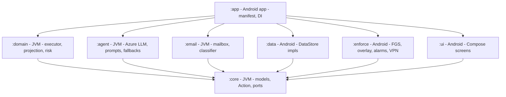
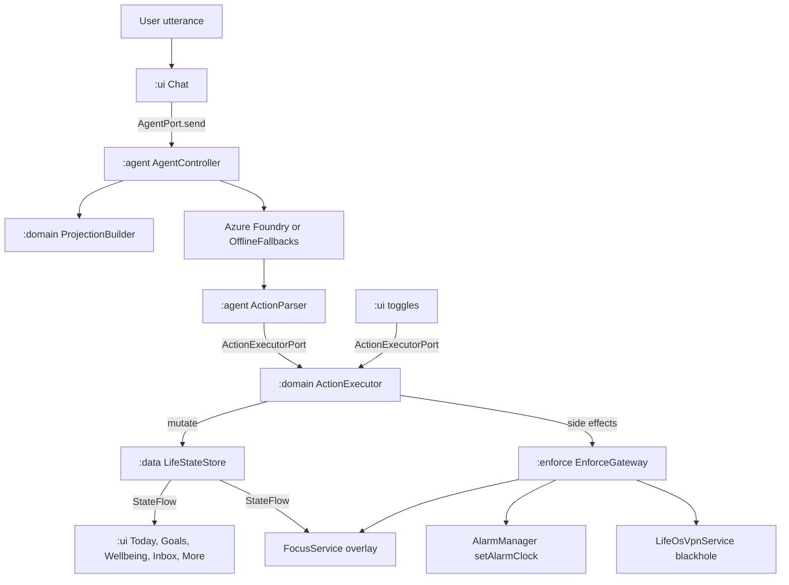
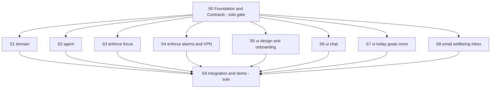

# LifeOS — Modular Build Orchestration

This is the **architecture and coordination** document. It decides how the app is partitioned, what each module is allowed to do, how modules talk to each other, and which subagent owns which files.

- **Product scope / permissions / demo:** [`lifeos_complete_hackathon_plan.md`](lifeos_complete_hackathon_plan.md)
- **UI look and screen behaviour:** [`lifeos_ui_technical_implementation.md`](lifeos_ui_technical_implementation.md)
- **Executable per-session plans:** [`subagents/`](subagents/)
- **Historical, superseded:** [`lifeos_hackathon_prototype_7372d322.plan.md`](lifeos_hackathon_prototype_7372d322.plan.md)

Constraints this document is written against: **hard 3-hour sprint**, **Azure AI Foundry GPT** (exact model chosen late) behind a swappable interface, one human opening **one Cursor session per subagent file**.

---

## 0. How to run the build

1. Run [`subagents/S0_foundation.md`](subagents/S0_foundation.md) **alone**. Nothing else may start until its exit gate passes.
2. When S0 is green, open **eight** sessions in parallel: S1 through S8.
3. When Wave 1 lands, run [`subagents/S9_integration_demo.md`](subagents/S9_integration_demo.md) **alone**.

Paste into each new session:

> Execute the plan in `.cursor/plans/subagents/<FILE>`. You own only the files listed under "Files you own". Do not create, edit, or delete any other file. Do not change the `:core` public API. Stop at the acceptance checklist.

---

## 1. Corrections to the earlier plans

These are deliberate reversals. Do not "fix" them back.

- **Multi-module Gradle, not a single `:app`.** The UI plan's "single module, packages as logical modules" is dropped. Eight concurrent sessions in one working tree only stay conflict-free when ownership is enforced by the build graph rather than by convention.
- **The VPN app-filter direction in the old plan is backwards.** `VpnService.Builder.addDisallowedApplication(pkg)` makes that package **bypass** the tunnel and reach the internet normally. To starve an app you must `addAllowedApplication(pkg)` so its traffic enters our TUN, then read the file descriptor and discard the packets. Blacklist and whitelist therefore invert:
  - **Blacklist `X`** → `addAllowedApplication(X)` → X's packets enter the blackhole; every other app bypasses.
  - **Whitelist `A, B, LifeOS`** → `addDisallowedApplication` each of A, B, LifeOS → they bypass and work; everything else enters the blackhole.
- **No `responseSchema` / no strict structured outputs.** Azure `strict: true` requires `additionalProperties: false` with every property required, which cannot express a 25-variant action union without generating an enormous schema. Primary path is `response_format: {"type":"json_object"}`, the action grammar described in the system prompt with two worked examples, and a **tolerant hand-rolled parser** that skips unknown action types instead of throwing. Strict `json_schema` is a post-hackathon upgrade.
- **`:enforce` never writes life state.** Only `ActionExecutor` in `:domain` mutates `CanonicalLifeState`. The foreground service *reads* rules from `LifeStateStore.state`, *reads* usage from `UsageStatsManager` on demand, and keeps override-grace timestamps in process memory. This deletes the whole write-race surface between the service and the UI, and means daily usage counters are never persisted.
- **`compileSdk = 36`, `targetSdk = 36`, `minSdk = 29`.** `android-37` is not installed locally and installing it buys nothing for the demo. The app runs fine on the API 37 emulator.
- **`gradle.properties` must pin the JDK.** System Java is 25, which AGP 8.13.2 rejects. Without `org.gradle.java.home=/home/sumit/app/android-studio/jbr` every session fails identically on the first build.

---

## 2. Environment facts (verified on this machine)

- Android SDK: `/home/sumit/Android/Sdk`. Platforms `android-34, 35, 36, 36.1`. Build-tools `35.0.0, 36.0.0, 36.1.0, 37.0.0`. `cmdline-tools/latest` present.
- JDK for Gradle: `/home/sumit/app/android-studio/jbr` → **OpenJDK 21.0.10**. System JDK is 25 (unusable for AGP).
- Gradle wrapper distributions already cached: `8.12`, `8.14.3`, `9.1.0`. Use **8.14.3**.
- Cached and usable offline: AGP `8.13.2`, Kotlin `2.2.20`.
- **Not cached:** Compose, DataStore, OkHttp, coroutines, serialization, navigation, lifecycle. The first Gradle sync is a multi-minute download. `dl.google.com` and `repo.maven.apache.org` are reachable.
- Emulator already running: `emulator-5554`, `sdk_gphone16k_x86_64`, **Android 17 / API 37**, 16 KB page size (irrelevant, we ship no native libs).
- Installed packages usable as block targets: `com.android.chrome`, `com.google.android.youtube`, `com.google.android.apps.docs`, `com.google.android.apps.maps`, `com.google.android.apps.youtube.music`. **Instagram is not installed** — hence `AppCatalog.resolveOrSubstitute`.
- `adb`: `/home/sumit/Android/Sdk/platform-tools/adb` (already on `PATH`).

---

## 3. Module graph

Four **pure-JVM** modules (millisecond unit tests, no emulator) and four **Android** modules.



The load-bearing rule: **`:ui` depends on `:core` and nothing else.** Screens talk to port interfaces, never to `:domain` or `:agent` classes. That single constraint is what allows the UI agents and the logic agents to run at the same time without waiting on each other.

Second rule: **`:core` has no dependencies on the other seven.** It is the only shared vocabulary, and it is frozen after Wave 0.

---

## 4. Module contracts

### 4.1 `:core` — frozen vocabulary

- **Type:** Kotlin JVM library. Zero `android.*` imports (enforced by the module type).
- **Responsibility:** every shared data class, the `Action` union, and every port interface.
- **Input:** none. It is the leaf of the graph.
- **Output:** `CanonicalLifeState`, `ChatTranscript`, all entities, `sealed interface Action`, `LlmConfig`, `ExecuteReport`, `LifeStateProjection`, `TimelineItem`, `PermissionStatus`, and the ten port interfaces in §5.
- **Communication:** plain Kotlin values plus `StateFlow` for observation. No callbacks, no `Context`.
- **Intelligence / AI creds:** none.
- **Dependencies:** `kotlinx-serialization-json`, `kotlinx-coroutines-core`.
- **Owner:** S0 only. **Frozen after Wave 0.**

### 4.2 `:domain` — the only writer

- **Type:** Kotlin JVM library.
- **Responsibility:** `ActionExecutor`, `ProjectionBuilder`, `Compactor`, `RiskCalculator`, `TimelineMerger`.
- **Input:** `List<Action>` plus `ActionOrigin`, the current `CanonicalLifeState`, chat messages.
- **Output:** mutated state through `LifeStateStore.mutate`, plus `ExecuteReport` (applied / skipped chips), `LifeStateProjection` for prompts, `List<TimelineItem>` for the Today screen, and integer risk percentages.
- **Communication:** calls `LifeStateStore.mutate`, then fires OS side effects through `EnforceGateway`. It never touches Android APIs directly.
- **Intelligence:** none. Fully deterministic, which is why risk and timeline never embarrass us on stage.
- **Owner:** S1.

### 4.3 `:agent` — the planner

- **Type:** Kotlin JVM library.
- **Responsibility:** `AzureFoundryClient`, `SystemPromptBuilder`, `ActionParser`, `OfflineFallbacks`, `AgentController`.
- **Input:** user text, a fresh `LifeStateProjection`, the last-K chat window, the active persona, and an `LlmConfig?`.
- **Output:** `AgentTurnResult(reply, actions, source)`. It hands `actions` to `ActionExecutorPort` and never writes state itself.
- **Communication:** HTTPS `POST` to Azure via OkHttp.
- **Intelligence / AI creds:** **yes.** `AZURE_LLM_ENDPOINT`, `AZURE_LLM_DEPLOYMENT`, `AZURE_LLM_API_KEY`, `AZURE_LLM_API_VERSION`, read from `local.properties` into BuildConfig by `:app` and passed in as `LlmConfig`. **The module must be fully demoable with no key at all** via `OfflineFallbacks`.
- **Owner:** S2.

### 4.4 `:email` — ingestion

- **Type:** Kotlin JVM library. Seed data is a Kotlin `const` string, not an Android asset, precisely so this module stays pure JVM and unit-testable.
- **Responsibility:** `SeedMailboxSync`, `EmailClassifier`, and an `ImapMailboxSync` stretch.
- **Input:** a sync trigger and an optional `MailAccount`.
- **Output:** `List<EmailCandidate>`, each carrying a confidence score and a proposed `Action` for the executor to commit on confirm.
- **Communication:** in-memory seed in P0; IMAP over the network only if the sprint has room.
- **Intelligence:** optional. Regex plus date parsing is the P0 classifier. It may borrow `LlmClient` later, but must not require it.
- **Owner:** S8.

### 4.5 `:data` — persistence

- **Type:** Android library.
- **Responsibility:** `DataStoreLifeStateStore`, `DataStoreChatStore`, `SecretsStore`.
- **Input:** mutation lambdas.
- **Output:** hot `StateFlow`s of the two stores.
- **Communication:** one `DataStore<Preferences>` named `lifeos`, two string keys `life_state_v1` and `chat_v1`, whole-object JSON via `kotlinx.serialization`, all writes serialised through a `Mutex`. No Room, no KSP — annotation processing costs build time we do not have.
- **Intelligence:** none.
- **Owner:** S0.

### 4.6 `:enforce` — OS enforcement, write-free

- **Type:** Android library.
- **Responsibility:** `FocusService`, `TimeoutMonitor`, `OverlayController`, `UsageStatsHelper`, `SystemAccessImpl`, `AlarmScheduler`, `AlarmReceiver`, `AlarmActivity`, `BootReceiver`, `NotificationChannels`, `TtsSpeaker`, `LifeOsVpnService`, and `EnforceGatewayImpl`.
- **Input:** `EnforceGateway` method calls, plus observation of `LifeStateStore.state` for the current rules.
- **Output:** the overlay window, ongoing notifications, `AlarmManager` registrations, a TUN blackhole, spoken persona lines, and `PermissionStatus` reads.
- **Communication:** Android system services. The service obtains `LifeStateStore` from the application-scoped `AppContainer`; there is no binder protocol, because the whole app is one process.
- **Intelligence:** none.
- **Owner:** S3 (focus half) and S4 (alarms and VPN half). Their file sets are disjoint, and the module manifest is written by S0 so neither has to edit it.

### 4.7 `:ui` — presentation

- **Type:** Android library, Compose.
- **Responsibility:** theme tokens, nav shell, shared components, seven screens, one ViewModel per screen.
- **Input:** `StateFlow<CanonicalLifeState>`, `StateFlow<ChatTranscript>`, `PermissionStatus`, `AppCatalog`.
- **Output:** user intents dispatched to `AgentPort`, `ActionExecutorPort`, or `EnforceGateway`.
- **Communication:** Compose → ViewModel → port. ViewModels receive ports through a constructor, resolved from `AppContainer` by a tiny factory.
- **Intelligence:** none directly. The UI displays what the agent produced.
- **Owner:** S0 (theme, nav, placeholders, component stubs), S5 (components, onboarding), S6 (chat), S7 (today, goals, more), S8 (wellbeing, inbox).

### 4.8 `:app` — composition root

- **Type:** Android application.
- **Responsibility:** `LifeOsApplication`, `MainActivity`, the merged `AndroidManifest.xml`, and `AppContainer`.
- **Input:** BuildConfig fields sourced from `local.properties`.
- **Output:** the installable APK.
- **Communication:** `AppContainer` binds every port in §5 to a real implementation. Cutting a feature is deleting one binding here.
- **Intelligence:** passes `LlmConfig` into `:agent`. Never logs the key.
- **Owner:** S0 (skeleton with stub bindings) and S9 (real bindings).

---

## 5. The frozen `:core` API

S0 writes these exactly. **After Wave 0 begins, no subagent may change a signature.** If an agent believes a change is required, it must stop and report rather than edit, because seven other sessions are compiling against it.

```kotlin
// ---- state ----
interface LifeStateStore {
    val state: StateFlow<CanonicalLifeState>
    suspend fun mutate(block: (CanonicalLifeState) -> CanonicalLifeState)
}

interface ChatStore {
    val transcript: StateFlow<ChatTranscript>
    suspend fun mutate(block: (ChatTranscript) -> ChatTranscript)
}

interface SecretsStore {
    fun llmConfig(): LlmConfig?
}

// ---- mutation: implemented only in :domain ----
enum class ActionOrigin { AGENT, USER, EMAIL, SYSTEM }

interface ActionExecutorPort {
    suspend fun execute(actions: List<Action>, origin: ActionOrigin): ExecuteReport
}

// ---- read models: implemented only in :domain ----
interface ProjectionPort { fun build(state: CanonicalLifeState): LifeStateProjection }
interface TimelinePort  { fun forDate(state: CanonicalLifeState, dateIso: String): List<TimelineItem> }
interface RiskPort      { fun riskPercent(state: CanonicalLifeState, goalId: String): Int }
interface CompactorPort { suspend fun ensureWindow(): Unit }

// ---- agent ----
interface AgentPort { suspend fun send(userText: String): AgentTurnResult }
interface LlmClient { suspend fun complete(req: LlmRequest): Result<String> }

// ---- enforcement ----
interface EnforceGateway {
    fun startFocus(session: FocusSession)
    fun stopFocus()
    fun applyRules(rules: EnforcementRules)
    fun scheduleAlarm(spec: AlarmSpec)
    fun cancelAlarm(alarmId: String)
    fun startNetworkGuard(rules: NetworkRules)
    fun stopNetworkGuard()
    fun usageTodayMinutes(packages: List<String>): Map<String, Int>
}

interface SystemAccess { fun permissions(): PermissionStatus }

interface AppCatalog {
    suspend fun launchableApps(): List<InstalledApp>
    suspend fun resolveOrSubstitute(nameOrPackage: String): String?
}

// ---- email ----
interface MailboxSync { suspend fun fetch(account: MailAccount?): Result<List<RawMessage>> }
interface EmailClassifierPort { suspend fun classify(messages: List<RawMessage>): List<EmailCandidate> }
```

`resolveOrSubstitute` exists because the emulator has no Instagram. The model may emit `com.instagram.android`; the catalog silently substitutes an installed stand-in (`com.google.android.youtube`) so enforcement still visibly fires on stage. The substitution is logged, never hidden from the developer.

---

## 6. Canonical data model

One JSON blob per store. `CanonicalLifeState` is the compaction-proof source of truth; `ChatTranscript` is the disposable part.

```kotlin
@Serializable
data class CanonicalLifeState(
    val schemaVersion: Int = 1,
    val personaId: String = "strict",
    val memoryFacts: List<String> = emptyList(),
    val goals: List<Goal> = emptyList(),
    val tasks: List<Todo> = emptyList(),
    val events: List<Event> = emptyList(),
    val habits: List<Habit> = emptyList(),
    val scheduleBlocks: List<ScheduleBlock> = emptyList(),
    val alarms: List<AlarmSpec> = emptyList(),
    val appTimeouts: List<AppTimeout> = emptyList(),
    val focus: FocusRules = FocusRules(),
    val network: NetworkRules = NetworkRules(),
    val emailCandidates: List<EmailCandidate> = emptyList(),
    val settings: Settings = Settings(),
    val gamification: Gamification = Gamification(),
)

@Serializable
data class ChatTranscript(
    val messages: List<ChatMessage> = emptyList(),
    val summary: String = "",
)
```

Every entity created by a goal expansion carries a nullable `sourceGoalId`. That one field powers two features: the Wellbeing screen showing "From: Crack Google interview" under a timeout, and `RevertExpansion` deleting an entire expansion in one action.

**Compaction law:** `Compactor` may only read and write `ChatTranscript`. If a goal disappears because the transcript was summarised, the architecture has failed. Every LLM turn receives a freshly built `LifeStateProjection`, so the model always sees real goals, events, and timeouts regardless of what the chat window still contains.

---

## 7. Action catalog

25 actions, one `sealed interface Action` in `:core`, `@SerialName` matching the wire `type` string. `ActionExecutor` is an exhaustive `when`.

State:

- `create_goal`, `update_goal`, `archive_goal`
- `create_task`, `complete_task`
- `create_event`
- `create_habit`, `complete_habit_today`
- `add_schedule_block`
- `remember`, `set_persona`

Enforcement:

- `set_alarm`, `cancel_alarm`
- `set_app_timeout`, `clear_app_timeout`
- `focus_start`, `focus_stop`, `focus_set_apps`, `set_focus_windows`
- `network_set_mode`, `network_set_apps`

Email:

- `promote_email`, `dismiss_email`

Lifecycle:

- `revert_expansion`, `award_xp`

Parsing is deliberately **not** polymorphic `kotlinx.serialization`. An unknown `type` from the model must not crash the turn. `ActionParser` reads the array as `JsonArray`, dispatches on the `type` string, pulls fields with defaults, and routes anything unrecognised into `ExecuteReport.skipped` with a reason.

---

## 8. Runtime data flow



Note that the Wellbeing toggles go through `ActionExecutorPort` too, not straight to `EnforceGateway`. A switch flip and a chat sentence therefore travel the identical code path, which halves the number of ways enforcement can drift out of sync with displayed state.

---

## 9. Stub-first: why the parallelism works

S0 does not merely create empty module folders. It creates **a compiling no-op implementation of every port in §5** and **placeholder Composables with their final signatures**. Three consequences:

1. No Wave 1 agent is ever blocked on another agent's module.
2. No agent needs to touch a file another agent owns — including the `:enforce` manifest and the shared `:ui` components, both of which S0 pre-writes.
3. `./gradlew assembleDebug` is green at every single moment of the sprint, so a broken build always means "the change I just made", never "somebody else is mid-flight".

S9 then replaces stubs with real bindings inside `AppContainer`, which is one file.

---

## 10. Execution waves



### Wave 0 — solo gate, 0:00 to 0:40

- [`S0_foundation.md`](subagents/S0_foundation.md) — build files, JBR pin, all of `:core`, `:data` DataStore impls, `:app` manifest and `AppContainer` stubs, `:ui` theme and nav and placeholders and component stubs. Exit gate is hard: `assembleDebug` green, `adb install` succeeds, six tabs navigate on `emulator-5554`.

### Wave 1 — eight parallel sessions, 0:40 to 2:10

- [`S1_domain.md`](subagents/S1_domain.md) — `:domain`. No AI creds. JVM tests only, no emulator.
- [`S2_agent.md`](subagents/S2_agent.md) — `:agent`. **AI creds.** Must work with none.
- [`S3_enforce_focus.md`](subagents/S3_enforce_focus.md) — `:enforce` focus, timeouts, overlay, usage, permissions read.
- [`S4_enforce_alarms_vpn.md`](subagents/S4_enforce_alarms_vpn.md) — `:enforce` alarms, TTS, boot, notifications, VPN.
- [`S5_ui_design_onboarding.md`](subagents/S5_ui_design_onboarding.md) — `:ui` shared components and Onboarding.
- [`S6_ui_chat.md`](subagents/S6_ui_chat.md) — `:ui` Chat.
- [`S7_ui_today_goals_more.md`](subagents/S7_ui_today_goals_more.md) — `:ui` Today, Goals, More.
- [`S8_email_wellbeing_inbox.md`](subagents/S8_email_wellbeing_inbox.md) — `:email` plus `:ui` Wellbeing and Inbox.

### Wave 2 — solo, 2:10 to 2:45

- [`S9_integration_demo.md`](subagents/S9_integration_demo.md) — real bindings, secrets, seed demo, `adb` permission grants, end-to-end run, APK, demo script.

### 2:45 to 3:00

Record the 90-second demo. No code changes.

---

## 11. File ownership map

Exclusive ownership. If a path is not in your list, you may read it but not write it.

- **S0** — `settings.gradle.kts`, `build.gradle.kts`, `gradle.properties`, `gradle/libs.versions.toml`, `gradlew*`, `.gitignore`, all eight `*/build.gradle.kts`, everything under `core/`, everything under `data/`, everything under `app/`, and in `ui/`: `theme/`, `nav/`, `components/` stubs, the seven placeholder screen files, `UiPorts.kt`. Also `enforce/src/main/AndroidManifest.xml`, `enforce/EnforceGatewayImpl.kt`, `enforce/EnforceHolder.kt`, and stubs throughout `enforce/**`, `domain/**`, `agent/**`, `email/**`.
- **S1** — `domain/src/main/kotlin/**`, `domain/src/test/kotlin/**`.
- **S2** — `agent/src/main/kotlin/**`, `agent/src/test/kotlin/**`.
- **S3** — `enforce/src/main/kotlin/com/lifeos/enforce/focus/**`, `.../usage/**`, `.../system/**`, `enforce/src/main/res/layout/overlay_block.xml`, `enforce/src/main/res/values/strings_focus.xml`.
- **S4** — `enforce/src/main/kotlin/com/lifeos/enforce/alarm/**`, `.../notify/**`, `.../vpn/**`, `enforce/src/main/res/layout/activity_alarm.xml`, `enforce/src/main/res/values/strings_alarm.xml`.
- **S5** — `ui/src/main/kotlin/com/lifeos/ui/components/**`, `.../screens/onboarding/**`.
- **S6** — `ui/src/main/kotlin/com/lifeos/ui/screens/chat/**`.
- **S7** — `ui/src/main/kotlin/com/lifeos/ui/screens/today/**`, `.../screens/goals/**`, `.../screens/more/**`.
- **S8** — `email/src/main/kotlin/**`, `email/src/test/kotlin/**`, `ui/src/main/kotlin/com/lifeos/ui/screens/wellbeing/**`, `.../screens/inbox/**`.
- **S9** — `app/src/main/kotlin/com/lifeos/app/AppContainer.kt`, `app/build.gradle.kts` (BuildConfig fields only), `local.properties`, `.cursor/plans/demo_script.md`, plus targeted fixes anywhere a Wave 1 agent left the build red.

`EnforceGatewayImpl.kt` and `EnforceHolder.kt` are the two shared `:enforce` files. S0 writes both complete: the gateway delegates to the focus, alarm, and VPN controllers it also stubs, and the holder gives Android-constructed classes (`FocusService`, `AlarmReceiver`, `BootReceiver`) a process-wide handle on `LifeStateStore`, since they have no constructor to inject into. S3 and S4 fill in the controller classes without editing either shared file.

Note that S4 owns `notify/NotificationChannels` but S3 depends on it for the focus service notification. S4's plan therefore front-loads it into its first ten minutes, and S0's stub already creates the `lifeos_focus` channel so S3 is never actually blocked.

---

## 12. Shared freeze rules

Every subagent file restates these. They are non-negotiable.

1. **The `:core` public API is frozen** after Wave 0. Stop and report rather than edit it.
2. **Only `:domain`'s `ActionExecutor` mutates `CanonicalLifeState`.** `:email` proposes candidates; the executor commits them. `:enforce` never writes.
3. **Only `:agent` talks to an LLM.** The UI never calls Azure. `:email`'s P0 classifier is regex.
4. **`:ui` never calls `AlarmManager`, `UsageStatsManager`, `VpnService`, or `WindowManager`.** It goes through ports.
5. **No `AccessibilityService`.** Play declaration plus Android 17 Advanced Protection revocation. `PACKAGE_USAGE_STATS` polling is the decided mechanism.
6. **No Room, no Hilt, no KSP.** Annotation processing costs build time the sprint does not have. `AppContainer` is a hand-written service locator.
7. **Offline fallbacks in `:agent` are mandatory** even when a key is present.
8. **Never commit secrets.** `local.properties` is gitignored; keys reach code only through BuildConfig.
9. **Do not add a dependency** that is not already in `gradle/libs.versions.toml`. Ask S9 instead; an unexpected download stalls every other session.

---

## 13. Secrets

- `AZURE_LLM_ENDPOINT` — `:agent`. Not required for the demo.
- `AZURE_LLM_DEPLOYMENT` — `:agent`. Not required for the demo.
- `AZURE_LLM_API_KEY` — `:agent`. Not required for the demo.
- `AZURE_LLM_API_VERSION` — `:agent`. Defaults to `2024-10-21`.
- IMAP password — `:email`. Not required; the seed mailbox covers P0.

All five live in `local.properties`, are surfaced as `buildConfigField` entries in `app/build.gradle.kts`, and are wrapped into `LlmConfig` by `AppContainer`. Absent values must degrade, never crash.

---

## 14. Cut order

Because every feature is one `AppContainer` binding, cutting is deleting a line rather than untangling code. Cut in this order:

1. VPN network guard (S4's second half)
2. IMAP sync (keep the seed mailbox)
3. Inbox screen and `:email` entirely
4. Scheduled focus windows (keep manual focus sessions and daily timeouts)
5. TTS on the alarm (keep the full-screen alarm)
6. Personas down to one

**Never cut:** chat → executor → persisted state, offline fallbacks, the focus overlay, the app-timeout overlay, Today and Goals, and the onboarding grant flow. Those six are the demo.

---

## 15. Known risks

- **Gradle lock contention.** Eight sessions running `./gradlew` in one tree serialise on the cache lock. Each subagent file caps itself at two or three verification builds, prefers `compileKotlin` on the JVM modules, and instructs the agent to wait and retry on `Timeout waiting to lock`.
- **A broken S0 poisons all eight.** Hence the hard three-step exit gate before any Wave 1 session opens.
- **First sync is a long download.** S0's very first action is kicking off dependency resolution so the wait overlaps with writing `:core`.
- **The Azure model is undecided.** Only `LlmConfig` and `AzureFoundryClient` know about it, so a late decision is a `local.properties` edit.
- **API 37 quirks.** Full-screen-intent may not be auto-granted, so S4 must implement the `canUseFullScreenIntent()` fallback to a high-priority notification. Usage access returns empty silently until granted, so S9 grants it over `adb` before the run.
- **No Instagram on the emulator.** `AppCatalog.resolveOrSubstitute` and a `DemoPackages` constant keep the script working.

---

## 16. Plan index

- [`lifeos_complete_hackathon_plan.md`](lifeos_complete_hackathon_plan.md) — product, feature triage, permissions matrix, demo narrative
- [`lifeos_ui_technical_implementation.md`](lifeos_ui_technical_implementation.md) — design system and screen behaviour. Its "single `:app` module" section is superseded by §3 here.
- `lifeos_modular_build_orchestration.md` — **this file**: modules, contracts, ownership, waves
- [`subagents/`](subagents/) — the ten executable session plans
- [`lifeos_hackathon_prototype_7372d322.plan.md`](lifeos_hackathon_prototype_7372d322.plan.md) — historical, superseded
