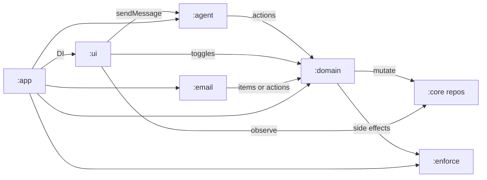
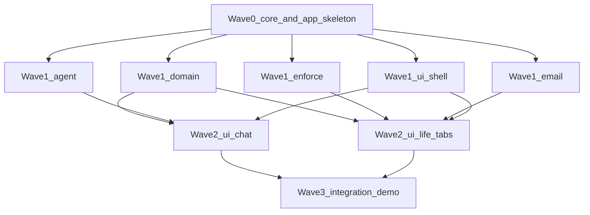

# LifeOS — Modular Build Orchestration

**How to use:** Open one Cursor session per subagent plan under [`.cursor/plans/subagents/`](subagents/). Execute in waves. Do not skip Wave 0.

**Product source of truth:** [`lifeos_complete_hackathon_plan.md`](lifeos_complete_hackathon_plan.md)  
**UI source of truth:** [`lifeos_ui_technical_implementation.md`](lifeos_ui_technical_implementation.md)

---

## 1. Gradle modules (developer-modular)

```text
lifeos/
├── settings.gradle.kts          # include all below
├── build.gradle.kts
├── core/                        # :core   — models, ports, no AI
├── domain/                      # :domain — ActionExecutor, projection, risk
├── agent/                       # :agent  — Gemini + offline fallbacks (AI)
├── enforce/                     # :enforce — Focus, timeouts, VPN, alarms
├── email/                       # :email  — mailbox sync + classify
├── ui/                          # :ui     — Compose theme, nav, all screens
└── app/                         # :app    — Application, Manifest, DI wiring
```

| Module | Depends on | AI creds? |
| --- | --- | --- |
| `:core` | none (Android library) | **No** |
| `:domain` | `:core` | **No** |
| `:agent` | `:core`, `:domain` (interfaces only) | **Yes** — `GEMINI_API_KEY` (optional if offline fallbacks) |
| `:enforce` | `:core` | **No** |
| `:email` | `:core` | **Optional** — classifier can use Gemini or regex |
| `:ui` | `:core`, `:domain` (observe Flow + call ports) | **No** directly |
| `:app` | all modules | Wires secrets into `:agent` / `:email` |

---

## 2. Module contracts (I/O / interface / communication)

### 2.1 `:core` — Canonical contracts

| | |
| --- | --- |
| **Responsibility** | Shared models, sealed `Action` types, repository **interfaces**, enforce/mail/agent **ports**, constants |
| **Inputs** | None (leaf) |
| **Outputs** | Published API consumed by every other module |
| **Intelligence** | None |
| **Comm** | Pure Kotlin types + `StateFlow`/`Flow` interfaces; no Android UI |

**Must export:**

- `CanonicalLifeState`, `ChatTranscript`, entity data classes (Goal, Todo, Event, Habit, AppTimeout, …)
- `sealed class Action` + kotlinx.serialization discriminators
- `interface LifeStateRepository { val state: StateFlow<CanonicalLifeState>; suspend fun update(...) }`
- `interface ChatRepository`
- `interface EnforceGateway` — start/stop focus, apply timeouts snapshot, scheduleAlarm, start/stop VPN
- `interface MailboxSync`
- `interface AgentClient { suspend fun complete(prompt: AgentPrompt): AgentResponse }`
- `interface ActionExecutorPort { suspend fun execute(actions: List<Action>): ExecuteReport }`

### 2.2 `:domain` — Brain of mutations (no LLM)

| | |
| --- | --- |
| **Responsibility** | `ActionExecutor`, `ProjectionBuilder`, `Compactor`, `RiskCalculator`, `TimelineMerger` |
| **Inputs** | `List<Action>`, current `CanonicalLifeState`, chat messages |
| **Outputs** | Updated life state via `LifeStateRepository`; `ExecuteReport`; `LifeStateProjection`; timeline items |
| **Intelligence** | None (deterministic) |
| **Comm** | Calls `LifeStateRepository` + `EnforceGateway` for side effects |

### 2.3 `:agent` — Planner LLM

| | |
| --- | --- |
| **Responsibility** | Build prompts, call Gemini, parse JSON, offline fallbacks, `AgentController` |
| **Inputs** | User text + `LifeStateProjection` + chat window + persona |
| **Outputs** | `AgentResponse(reply, actions)` → handed to `ActionExecutorPort` |
| **Intelligence** | **Gemini Flash** — needs `GEMINI_API_KEY`. Offline fallbacks **must** work without key |
| **Comm** | HTTPS to `generativelanguage.googleapis.com`; never writes DataStore itself |

### 2.4 `:enforce` — OS enforcement

| | |
| --- | --- |
| **Responsibility** | `FocusService`, `TimeoutMonitor`, `OverlayController`, `LifeOsVpnService`, alarms |
| **Inputs** | `EnforceGateway` method calls + reads latest rules from repository or binder snapshot |
| **Outputs** | Overlay UI, notifications, VPN TUN, AlarmManager, TTS alarm activity |
| **Intelligence** | None |
| **Comm** | Android system services; FGS; WindowManager |

### 2.5 `:email` — Ingestion

| | |
| --- | --- |
| **Responsibility** | `SeedMailboxSync`, `ImapMailboxSync` (stretch), `GmailMailboxSync` (P1 stub), `EmailClassifier` |
| **Inputs** | Sync trigger; account config; raw messages |
| **Outputs** | `EmailItem` / candidates written via repository actions or email-specific repo API |
| **Intelligence** | Classifier: regex P0; Gemini **optional** (same API key) |
| **Comm** | IMAP network / Gmail API / local assets |

### 2.6 `:ui` — Presentation

| | |
| --- | --- |
| **Responsibility** | Theme, nav shell, onboarding, Chat/Today/Goals/Inbox/Wellbeing/More |
| **Inputs** | `StateFlow<CanonicalLifeState>`, chat messages, permission helpers |
| **Outputs** | User intents → `AgentController.sendMessage` or `ActionExecutorPort` / `EnforceGateway` |
| **Intelligence** | None (displays agent results) |
| **Comm** | Compose → ViewModels → ports from `:app` DI |

### 2.7 `:app` — Composition root

| | |
| --- | --- |
| **Responsibility** | `Application`, `MainActivity`, Manifest, `AppContainer` wiring real implementations |
| **Inputs** | BuildConfig / secrets |
| **Outputs** | Runnable APK |
| **Intelligence** | Passes API key into agent |
| **Comm** | Wires all modules |



---

## 3. Parallel execution waves



| Wave | Subagent plan file | Parallel? | Blocked by |
| --- | --- | --- | --- |
| 0 | [`subagents/00_core_contracts.md`](subagents/00_core_contracts.md) | Solo | — |
| 1 | [`01_domain_executor.md`](subagents/01_domain_executor.md) | Yes | Wave 0 |
| 1 | [`02_agent.md`](subagents/02_agent.md) | Yes | Wave 0 |
| 1 | [`03_enforce.md`](subagents/03_enforce.md) | Yes | Wave 0 |
| 1 | [`04_email.md`](subagents/04_email.md) | Yes | Wave 0 |
| 1 | [`05_ui_shell.md`](subagents/05_ui_shell.md) | Yes | Wave 0 |
| 2 | [`06_ui_chat.md`](subagents/06_ui_chat.md) | Yes | 01, 02, 05 |
| 2 | [`07_ui_life_tabs.md`](subagents/07_ui_life_tabs.md) | Yes | 01, 03, 04, 05 |
| 3 | [`08_integration_demo.md`](subagents/08_integration_demo.md) | Solo | Wave 2 |

**Session instructions for humans:** Create a new Cursor chat per file. Paste: “Execute the plan in `.cursor/plans/subagents/<file>. Do not expand scope beyond that module’s exit criteria.”

---

## 4. Shared freeze rules (all subagents)

1. Do **not** change `:core` public API after Wave 0 without updating this orchestration doc and all dependents.
2. Only `:domain`’s `ActionExecutor` mutates `CanonicalLifeState` (email may propose; executor commits).
3. Only `:agent` talks to Gemini.
4. UI never calls Gemini or AlarmManager directly.
5. No AccessibilityService. No Room in P0.
6. Offline fallbacks required in `:agent` even if key present.

---

## 5. Secrets

| Secret | Module | Required for demo? |
| --- | --- | --- |
| `GEMINI_API_KEY` | `:agent` | No (offline fallbacks) |
| IMAP password / Gmail OAuth | `:email` | No (seed mailbox) |

Store via local `local.properties` / BuildConfig — never commit keys.

---

## 6. Plan index

| File | Purpose |
| --- | --- |
| [`lifeos_complete_hackathon_plan.md`](lifeos_complete_hackathon_plan.md) | Product, permissions, triage, demo |
| [`lifeos_ui_technical_implementation.md`](lifeos_ui_technical_implementation.md) | UI screens + design |
| [`lifeos_modular_build_orchestration.md`](lifeos_modular_build_orchestration.md) | **This file** — modules + waves |
| [`lifeos_hackathon_prototype_7372d322.plan.md`](lifeos_hackathon_prototype_7372d322.plan.md) | Historical early prototype |
| [`subagents/*.md`](subagents/) | Executable per-session build plans |
